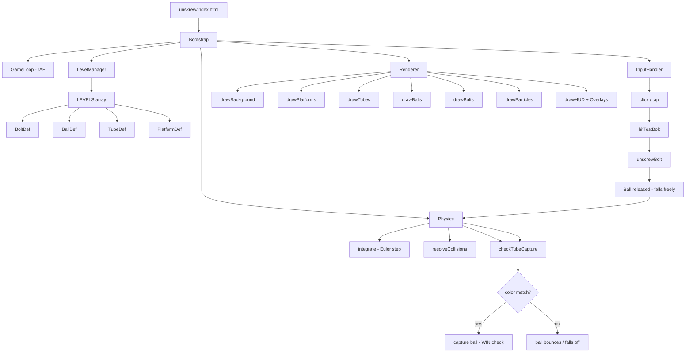
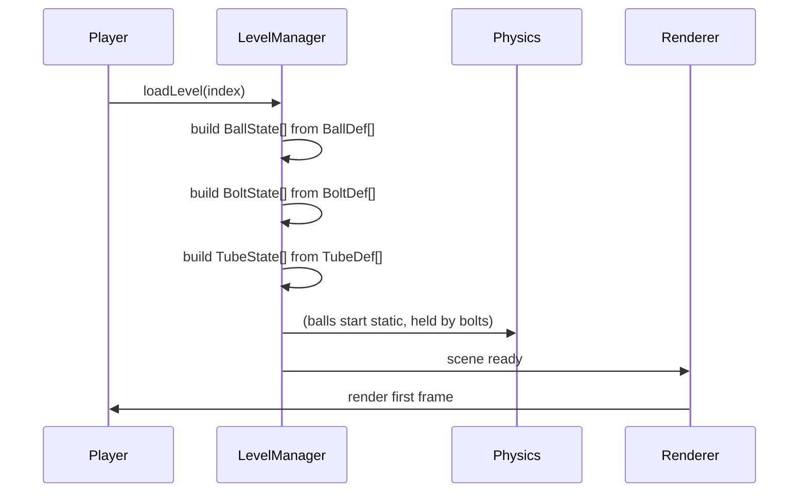
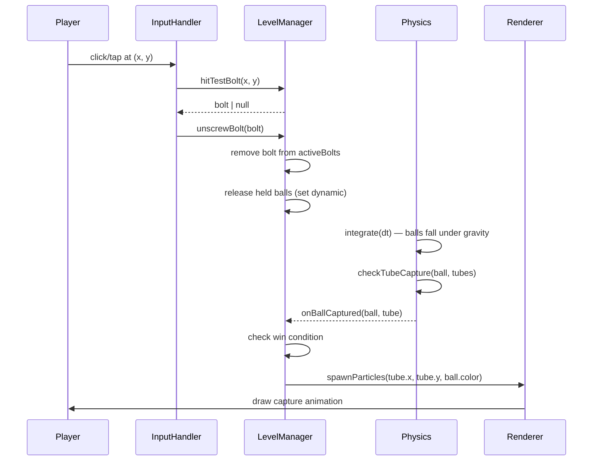
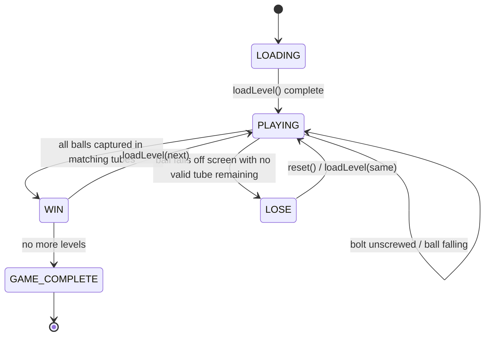

# Design Document: Unskrew

## Overview

Unskrew is a browser-based physics puzzle game where the player unscrews bolts to release colored balls that must fall into matching colored tubes/containers. Inspired by the mobile game TakeOff Bolts, the game runs entirely in a single `unskrew/index.html` file with no build step, using the Canvas 2D API for rendering and a lightweight custom physics simulation (gravity + collision) — no external physics library required.

The visual style is clean, bright, and colorful: white or light-grey board backgrounds, vivid solid-color balls, and satisfying pop animations when a ball lands in its matching tube. This deliberately contrasts with Weak Threads' dark neon aesthetic.

The game is structured identically to `weak-threads/index.html`: one self-contained HTML file, CDN fonts only, Canvas 2D rendering, and a `requestAnimationFrame` game loop.

---

## Architecture



---

## Sequence Diagrams

### Level Load Flow



### Unscrew Bolt Flow



---

## Components and Interfaces

### LevelManager

**Purpose**: Owns level definitions, manages runtime state for balls/bolts/tubes, tracks win/loss.

**Interface**:
```javascript
interface LevelManager {
  loadLevel(index: number): void
  hitTestBolt(x: number, y: number): BoltState | null
  unscrewBolt(bolt: BoltState): void
  onBallCaptured(ball: BallState, tube: TubeState): void
  checkWin(): boolean
  reset(): void
}
```

**Responsibilities**:
- Holds the `LEVELS` array of `LevelData` definitions
- Instantiates runtime `BallState`, `BoltState`, `TubeState` objects from level data
- Determines which balls are held by which bolts
- Detects win (all balls captured in matching tubes) and lose (ball falls off screen with no match possible)

---

### Physics

**Purpose**: Lightweight custom physics — gravity integration, platform collision, tube capture detection. No external library.

**Interface**:
```javascript
interface Physics {
  integrate(balls: BallState[], platforms: PlatformDef[], dt: number): void
  checkTubeCapture(balls: BallState[], tubes: TubeState[]): CaptureEvent[]
  resolveWallBounce(ball: BallState, canvasW: number, canvasH: number): void
}
```

**Responsibilities**:
- Applies gravity to dynamic (released) balls each frame
- Resolves ball–platform collisions (AABB vs circle)
- Resolves ball–ball collisions (circle vs circle)
- Detects when a ball enters a tube opening (circle centre within tube mouth AABB)
- Returns `CaptureEvent[]` for the game loop to process

---

### Renderer

**Purpose**: Draws the entire scene each frame onto a `<canvas>` element using Canvas 2D API.

**Interface**:
```javascript
interface Renderer {
  init(canvas: HTMLCanvasElement): void
  drawFrame(state: RenderState): void
  spawnParticles(x: number, y: number, color: string, type: 'capture' | 'pop'): void
}
```

**Responsibilities**:
- Clears and redraws canvas every frame
- Draws platforms, tubes (open-top rectangles with color fill), balls (circles with gradient), bolts (hex-head screw icon)
- Animates bolt unscrewing (rotation tween over ~300ms)
- Manages particle system for capture celebrations
- Draws HUD: level number, restart button
- Draws overlays: win screen with next-level button, lose screen

---

### InputHandler

**Purpose**: Translates mouse/touch events into game actions.

**Interface**:
```javascript
interface InputHandler {
  attach(canvas: HTMLCanvasElement): void
  detach(): void
  onTap(handler: (x: number, y: number) => void): void
}
```

**Responsibilities**:
- Listens for `mousedown` and `touchstart`
- Converts event coordinates to canvas logical space (accounting for `devicePixelRatio` and canvas CSS size)
- Fires `onTap` callback with canvas-space coordinates

---

## Data Models

### LevelData

```javascript
/**
 * Complete description of a single puzzle level.
 */
const LevelData = {
  id: Number,              // 1-based
  name: String,            // display name, e.g. "First Drop"
  platforms: [PlatformDef],// static surfaces balls can rest on or slide off
  bolts: [BoltDef],        // screws holding balls in place
  balls: [BallDef],        // colored balls, each held by one or more bolts
  tubes: [TubeDef],        // target containers, one per color
}
```

### PlatformDef

```javascript
const PlatformDef = {
  x: Number,    // left edge
  y: Number,    // top edge
  width: Number,
  height: Number,
  angle: Number, // radians, 0 = horizontal (optional, default 0)
}
```

### BoltDef

```javascript
const BoltDef = {
  id: String,          // e.g. "b1"
  x: Number,           // centre x
  y: Number,           // centre y
  holdsBallIds: [String], // which balls this bolt pins in place
}
```

### BallDef

```javascript
const BallDef = {
  id: String,    // e.g. "ball1"
  color: String, // CSS color, e.g. "#ef4444" (red)
  x: Number,     // initial centre x (while held)
  y: Number,     // initial centre y (while held)
  radius: Number,// default 16
}
```

### TubeDef

```javascript
const TubeDef = {
  id: String,
  color: String,   // must match a BallDef color
  x: Number,       // left edge of tube opening
  y: Number,       // top edge of tube opening (mouth)
  width: Number,   // inner width (slightly > ball diameter)
  height: Number,  // depth of tube
  capacity: Number,// max balls it can hold (default 1)
}
```

### BallState (runtime)

```javascript
const BallState = {
  ...BallDef,       // inherits id, color, radius
  x: Number,        // current centre x
  y: Number,        // current centre y
  vx: Number,       // velocity x (px/s)
  vy: Number,       // velocity y (px/s)
  dynamic: Boolean, // false = held by bolt, true = falling freely
  captured: Boolean,// true = landed in matching tube
  capturedTubeId: String | null,
}
```

### BoltState (runtime)

```javascript
const BoltState = {
  ...BoltDef,
  angle: Number,       // current rotation (radians), animated during unscrew
  unscrewing: Boolean, // true during the unscrew animation
  removed: Boolean,    // true once fully unscrewed
}
```

### TubeState (runtime)

```javascript
const TubeState = {
  ...TubeDef,
  capturedBalls: [String], // ids of balls currently inside
}
```

### CaptureEvent

```javascript
const CaptureEvent = {
  ballId: String,
  tubeId: String,
  colorMatch: Boolean, // true if ball.color === tube.color
}
```

### Particle

```javascript
const Particle = {
  x: Number, y: Number,
  vx: Number, vy: Number,
  life: Number,   // 0.0–1.0
  color: String,
  radius: Number,
}
```

---

## Game State Machine



**States**:
- `LOADING` — level data being instantiated, no input accepted
- `PLAYING` — normal gameplay, bolts clickable
- `WIN` — all balls matched, win overlay shown
- `LOSE` — a ball fell off screen and cannot be recovered
- `GAME_COMPLETE` — all levels beaten

---

## Algorithmic Pseudocode

### Main Game Loop

```pascal
ALGORITHM gameLoop(timestamp)
INPUT: timestamp — DOMHighResTimeStamp
OUTPUT: side effects (physics step + canvas draw)

BEGIN
  dt ← clamp((timestamp - lastTimestamp) / 1000, 0, 0.05)
  lastTimestamp ← timestamp

  IF gameState = PLAYING THEN
    physics.integrate(balls, platforms, dt)
    physics.resolveWallBounce(balls, CANVAS_W, CANVAS_H)
    events ← physics.checkTubeCapture(balls, tubes)
    FOR each event IN events DO
      levelManager.onBallCaptured(event)
      renderer.spawnParticles(event.x, event.y, event.color, 'capture')
    END FOR
    levelManager.checkLoseCondition()
  END IF

  renderer.drawFrame(buildRenderState(dt))
  requestAnimationFrame(gameLoop)
END
```

**Preconditions:**
- `physics`, `renderer`, `levelManager` are initialised
- `lastTimestamp` initialised on first frame

**Postconditions:**
- All dynamic balls advanced by `dt` seconds
- Capture events processed and state updated
- Canvas reflects current world state

**Loop Invariants:**
- `dt` always in `(0, 0.05]`
- `gameState` is one of `LOADING | PLAYING | WIN | LOSE | GAME_COMPLETE`

---

### Physics Integration (Euler)

```pascal
ALGORITHM integrate(balls, platforms, dt)
INPUT: balls — array of BallState
       platforms — array of PlatformDef
       dt — time step in seconds
OUTPUT: mutates ball positions and velocities

CONST GRAVITY ← 980  // px/s²
CONST RESTITUTION ← 0.35
CONST FRICTION ← 0.85

BEGIN
  FOR each ball IN balls WHERE ball.dynamic AND NOT ball.captured DO
    // Apply gravity
    ball.vy ← ball.vy + GRAVITY * dt

    // Integrate position
    ball.x ← ball.x + ball.vx * dt
    ball.y ← ball.y + ball.vy * dt

    // Resolve platform collisions
    FOR each platform IN platforms DO
      IF circleOverlapsRect(ball, platform) THEN
        normal ← computeCollisionNormal(ball, platform)
        penetration ← computePenetrationDepth(ball, platform)
        ball.x ← ball.x + normal.x * penetration
        ball.y ← ball.y + normal.y * penetration
        // Reflect velocity along normal with restitution
        dot ← ball.vx * normal.x + ball.vy * normal.y
        IF dot < 0 THEN
          ball.vx ← ball.vx - (1 + RESTITUTION) * dot * normal.x
          ball.vy ← ball.vy - (1 + RESTITUTION) * dot * normal.y
          // Apply friction to tangential component
          ball.vx ← ball.vx * FRICTION
        END IF
      END IF
    END FOR
  END FOR
END
```

**Preconditions:**
- All `dynamic` balls have valid `x`, `y`, `vx`, `vy`
- `dt > 0`

**Postconditions:**
- All dynamic, non-captured balls have updated positions and velocities
- No ball overlaps any platform after resolution

**Loop Invariants:**
- Gravity is applied before position integration each step
- Collision resolution does not increase kinetic energy (restitution ≤ 1)

---

### Bolt Hit Test

```pascal
ALGORITHM hitTestBolt(x, y, bolts)
INPUT: x, y — canvas tap coordinates
       bolts — array of active BoltState (not yet removed)
OUTPUT: BoltState within tap radius, or null

CONST TAP_RADIUS ← 24  // px

BEGIN
  FOR each bolt IN bolts WHERE NOT bolt.removed DO
    dist ← sqrt((bolt.x - x)^2 + (bolt.y - y)^2)
    IF dist <= TAP_RADIUS THEN
      RETURN bolt
    END IF
  END FOR
  RETURN null
END
```

**Preconditions:**
- `x`, `y` are in canvas logical coordinate space
- `bolts` contains only bolts that have not been removed

**Postconditions:**
- Returns the first bolt whose centre is within `TAP_RADIUS` of `(x, y)`
- Returns `null` if no bolt qualifies

---

### Tube Capture Detection

```pascal
ALGORITHM checkTubeCapture(balls, tubes)
INPUT: balls — array of BallState
       tubes — array of TubeState
OUTPUT: array of CaptureEvent

BEGIN
  events ← []

  FOR each ball IN balls WHERE ball.dynamic AND NOT ball.captured DO
    FOR each tube IN tubes DO
      IF tubeHasCapacity(tube) AND ballEntersTubeMouth(ball, tube) THEN
        colorMatch ← (ball.color = tube.color)
        events.append({
          ballId: ball.id,
          tubeId: tube.id,
          colorMatch: colorMatch
        })
        // Snap ball to rest position inside tube
        ball.x ← tube.x + tube.width / 2
        ball.y ← tube.y + tube.height - ball.radius - (tube.capturedBalls.length * ball.radius * 2.2)
        ball.vx ← 0
        ball.vy ← 0
        ball.captured ← true
        ball.capturedTubeId ← tube.id
        tube.capturedBalls.append(ball.id)
      END IF
    END FOR
  END FOR

  RETURN events
END
```

**Preconditions:**
- `balls` and `tubes` are consistent with current level state
- `ballEntersTubeMouth` checks ball centre is within tube mouth AABB

**Postconditions:**
- Each returned `CaptureEvent` corresponds to a ball that just entered a tube
- Captured balls have `captured = true` and zero velocity
- `tube.capturedBalls` updated

**Loop Invariants:**
- A ball can only be captured once (`ball.captured` prevents re-entry)
- Tube capacity is checked before capture

---

### Win Condition Check

```pascal
ALGORITHM checkWin(balls, tubes)
INPUT: balls — all BallState for current level
       tubes — all TubeState for current level
OUTPUT: boolean

BEGIN
  FOR each ball IN balls DO
    IF NOT ball.captured THEN
      RETURN false
    END IF
    tube ← findTubeById(tubes, ball.capturedTubeId)
    IF tube.color ≠ ball.color THEN
      RETURN false
    END IF
  END FOR
  RETURN true
END
```

**Preconditions:**
- All balls belong to the current level
- `capturedTubeId` is set for captured balls

**Postconditions:**
- Returns `true` if and only if every ball is captured in a color-matching tube
- No side effects

---

### Bolt Unscrew Animation

```pascal
ALGORITHM updateBoltAnimation(bolt, dt)
INPUT: bolt — BoltState with unscrewing = true
       dt — frame delta in seconds
OUTPUT: mutates bolt.angle; sets bolt.removed when complete

CONST UNSCREW_SPEED ← TWO_PI * 2  // 2 full rotations per second
CONST UNSCREW_DURATION ← 0.35     // seconds

BEGIN
  bolt.animTimer ← bolt.animTimer + dt
  bolt.angle ← bolt.angle + UNSCREW_SPEED * dt

  IF bolt.animTimer >= UNSCREW_DURATION THEN
    bolt.removed ← true
    bolt.unscrewing ← false
    // Release all balls held by this bolt
    FOR each ballId IN bolt.holdsBallIds DO
      ball ← findBallById(ballId)
      IF allHoldingBoltsRemoved(ball) THEN
        ball.dynamic ← true
      END IF
    END FOR
  END IF
END
```

**Preconditions:**
- `bolt.unscrewing = true`
- `bolt.animTimer` initialised to 0 when unscrewing begins

**Postconditions:**
- `bolt.angle` increases monotonically during animation
- `bolt.removed` set to `true` exactly once, after `UNSCREW_DURATION`
- Ball becomes dynamic only when ALL bolts holding it are removed

---

## Key Functions with Formal Specifications

### `loadLevel(index)`

```javascript
function loadLevel(index: number): void
```

**Preconditions:**
- `index` is an integer in `[0, LEVELS.length)`
- Canvas is initialised

**Postconditions:**
- `activeBolts`, `balls`, `tubes`, `platforms` populated from `LEVELS[index]`
- All balls start with `dynamic = false`, `captured = false`
- `gameState` set to `PLAYING`
- Previous level state fully cleared

---

### `unscrewBolt(bolt)`

```javascript
function unscrewBolt(bolt: BoltState): void
```

**Preconditions:**
- `bolt` is in `activeBolts`
- `bolt.removed === false`
- `gameState === 'PLAYING'`

**Postconditions:**
- `bolt.unscrewing` set to `true`, `bolt.animTimer` reset to `0`
- After animation completes: `bolt.removed = true`, bolt removed from `activeBolts`
- Any ball held exclusively by this bolt becomes `dynamic = true`
- `activeBolts.length` decremented by exactly 1 after animation

---

### `integrate(balls, platforms, dt)`

```javascript
function integrate(balls: BallState[], platforms: PlatformDef[], dt: number): void
```

**Preconditions:**
- `dt > 0` and `dt <= 0.05`
- All dynamic balls have finite `x`, `y`, `vx`, `vy`

**Postconditions:**
- All dynamic, non-captured balls have updated positions
- No ball penetrates any platform after resolution
- Captured and static balls are not modified

---

### `checkTubeCapture(balls, tubes)`

```javascript
function checkTubeCapture(balls: BallState[], tubes: TubeState[]): CaptureEvent[]
```

**Preconditions:**
- `balls` and `tubes` are from the same level
- Called after `integrate()` in the same frame

**Postconditions:**
- Returns array of `CaptureEvent` (may be empty)
- Each event's `ballId` refers to a ball that was `dynamic` and not `captured` before this call
- Captured balls have `vx = vy = 0` and `captured = true` after this call

---

### `hitTestBolt(x, y, bolts)`

```javascript
function hitTestBolt(x: number, y: number, bolts: BoltState[]): BoltState | null
```

**Preconditions:**
- `x`, `y` are in canvas logical coordinate space
- `bolts` contains only non-removed bolts

**Postconditions:**
- Returns a `BoltState` if one exists within `TAP_RADIUS` of `(x, y)`
- Returns `null` if no bolt qualifies
- No mutations to any bolt or ball state

---

### `drawFrame(state)`

```javascript
function drawFrame(state: RenderState): void
```

**Preconditions:**
- `state.ctx` is a valid 2D rendering context
- All positions in `state` are finite numbers

**Postconditions:**
- Canvas fully redrawn: background, platforms, tubes, balls, bolts, particles, HUD
- Canvas state restored after each draw call (save/restore)
- No mutations to any game state object

---

## Example Usage

```javascript
// Bootstrap
const canvas = document.getElementById('game-canvas')
const physics = new Physics()
const renderer = new Renderer()
const input = new InputHandler()
const levelManager = new LevelManager()

renderer.init(canvas)
input.attach(canvas)

// Wire tap → unscrew
input.onTap((x, y) => {
  if (levelManager.gameState !== 'PLAYING') return
  const bolt = levelManager.hitTestBolt(x, y)
  if (bolt) levelManager.unscrewBolt(bolt)
})

// Start level 0
levelManager.loadLevel(0)
requestAnimationFrame(gameLoop)

// Game loop
function gameLoop(ts) {
  const dt = Math.min(Math.max((ts - lastTs) / 1000, 0), 0.05)
  lastTs = ts

  if (levelManager.gameState === 'PLAYING') {
    physics.integrate(levelManager.balls, levelManager.platforms, dt)
    physics.resolveWallBounce(levelManager.balls, CANVAS_W, CANVAS_H)
    const events = physics.checkTubeCapture(levelManager.balls, levelManager.tubes)
    for (const ev of events) {
      levelManager.onBallCaptured(ev)
      const ball = levelManager.getBallById(ev.ballId)
      renderer.spawnParticles(ball.x, ball.y, ball.color, 'capture')
    }
    levelManager.updateBoltAnimations(dt)
    levelManager.checkLoseCondition()
  }

  renderer.drawFrame(levelManager.getRenderState(dt))
  requestAnimationFrame(gameLoop)
}
```

---

## Correctness Properties

### Property 1: loadLevel populates balls correctly

*For any* valid `LevelData`, after `loadLevel(index)`, `balls.length` equals `LEVELS[index].balls.length`, every ball has `dynamic = false` and `captured = false`.

**Validates: Requirements 2.2, 2.3**

### Property 2: Ball becomes dynamic only when all holding bolts are removed

*For any* ball held by N bolts, `ball.dynamic` becomes `true` if and only if all N bolts have `removed = true`.

**Validates: Requirements 5.5, 5.6**

### Property 3: dt is always clamped

*For any* frame timestamp, `dt` passed to `physics.integrate()` is always in `(0, 0.05]`.

**Validates: Requirements 6.6, 13.2**

### Property 4: Win condition requires all balls captured in matching tubes

*For any* level state, `checkWin()` returns `true` if and only if every ball has `captured = true` and `tube.color === ball.color` for its `capturedTubeId`.

**Validates: Requirements 8.1, 8.2, 8.3**

### Property 5: hitTestBolt returns null for empty input

*For any* `(x, y)`, `hitTestBolt(x, y, [])` returns `null`.

**Validates: Requirements 4.3**

### Property 6: hitTestBolt returns null when no bolt is within TAP_RADIUS

*For any* `(x, y)` and bolt set where all bolt centres are more than `TAP_RADIUS` px from `(x, y)`, `hitTestBolt` returns `null`.

**Validates: Requirements 4.2**

### Property 7: Captured ball velocity is zero

*For any* ball where `captured = true`, `ball.vx === 0` and `ball.vy === 0` at all subsequent frames.

**Validates: Requirements 7.2**

### Property 8: Tube capacity is never exceeded

*For any* sequence of capture events, `tube.capturedBalls.length <= tube.capacity` for every tube at every frame.

**Validates: Requirements 7.5**

### Property 9: Particle life is always in [0, 1]

*For any* particle in the particle array, `particle.life` is always in `[0, 1]`, and particles with `life <= 0` are removed before the next draw call.

**Validates: Requirements 11.3, 11.4**

### Property 10: Bolt removed exactly once

*For any* bolt, `bolt.removed` transitions from `false` to `true` exactly once and never reverts.

**Validates: Requirements 5.4**

### Property 11: checkTubeCapture does not mutate static balls

*For any* call to `checkTubeCapture`, balls with `dynamic = false` are not modified.

**Validates: Requirements 7.6**

### Property 12: Color mismatch does not prevent capture but does prevent win

*For any* ball captured in a tube where `ball.color !== tube.color`, `ball.captured = true` but `checkWin()` returns `false`.

**Validates: Requirements 7.7, 8.3**

---

## Error Handling

### Scenario 1: Level index out of bounds

**Condition**: `loadLevel(index)` called with `index >= LEVELS.length`
**Response**: Clamp to last valid index; log warning to console
**Recovery**: Game continues on last level

### Scenario 2: Ball falls off screen

**Condition**: `ball.y > CANVAS_H + ball.radius * 2` and ball is not captured
**Response**: Trigger `LOSE` state, show "Try Again" overlay
**Recovery**: Player clicks restart → `loadLevel(currentIndex)`

### Scenario 3: Ball enters wrong-color tube

**Condition**: `ball.color !== tube.color` on capture
**Response**: Ball is captured (stops moving) but `checkWin()` will return `false`; visual indicator (shake/red flash on tube) signals the mismatch
**Recovery**: This is a puzzle-fail state — player must restart the level

### Scenario 4: Font fails to load

**Condition**: HurmeGeoSans2 OTF not found (path issue)
**Response**: Canvas falls back to system sans-serif; game remains fully playable
**Recovery**: No action needed

---

## Testing Strategy

### Unit Testing Approach

Pure functions testable in isolation:
- `hitTestBolt(x, y, bolts)` — mock bolt positions, verify threshold behaviour
- `checkWin(balls, tubes)` — construct known states, verify true/false
- `checkTubeCapture(balls, tubes)` — mock ball positions at tube mouth
- `computeStars(total, remaining)` — pure integer function
- `circleOverlapsRect(ball, platform)` — geometric predicate

### Property-Based Testing Approach

**Property Test Library**: fast-check

- For all `(x, y)` where all bolt centres are > `TAP_RADIUS` away, `hitTestBolt` returns `null`
- For all levels, after `loadLevel`, every ball has `dynamic = false` and `captured = false`
- For all `dt` in `(0, 0.05]`, `integrate` does not produce `NaN` positions
- For all capture sequences, `tube.capturedBalls.length <= tube.capacity`
- For all particle spawn events, particle array length never exceeds cap (200)

### Integration Testing Approach

- Load each level, simulate N physics steps with all bolts removed, assert all balls eventually captured or fallen off
- Verify win state triggers only when all balls are in color-matching tubes

---

## Performance Considerations

- Canvas sized to `devicePixelRatio` for crisp rendering on retina displays
- Custom physics (no Matter.js) keeps the file self-contained and avoids CDN dependency for physics
- Ball count per level is small (≤ 8), so O(n²) ball–ball collision is negligible
- Particle array capped at 200; oldest evicted when cap is reached
- Bolt unscrew animation is a simple timer — no tweening library needed

---

## Security Considerations

- No user data persisted or transmitted — fully offline
- No `eval` or dynamic code execution
- No external scripts beyond font files (which are local)

---

## Dependencies

| Resource | Source | Purpose |
|---|---|---|
| HurmeGeoSans2 | `../fonts/hurme-geometric-sans/` | UI typography |

No JavaScript library dependencies. Canvas 2D API used directly for rendering. Physics implemented from scratch (Euler integration + AABB/circle collision).
