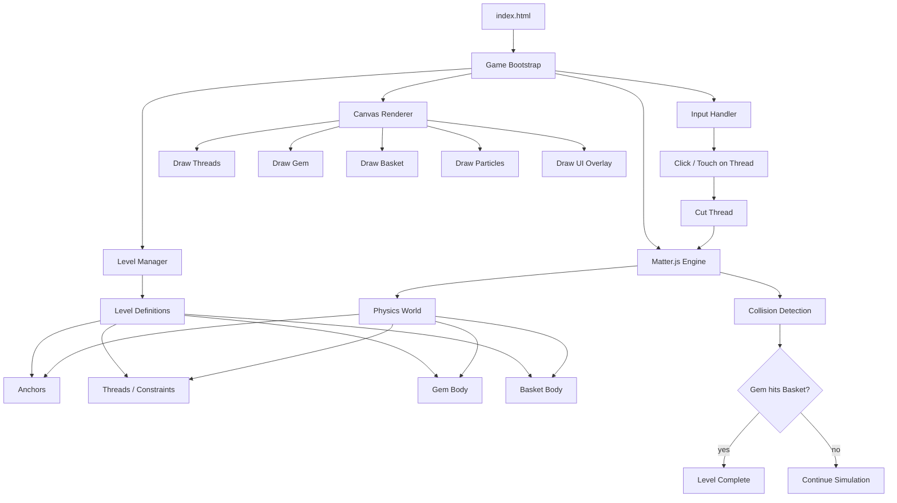
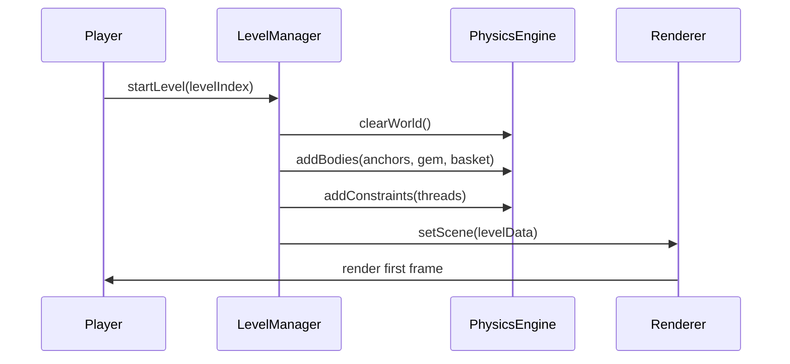
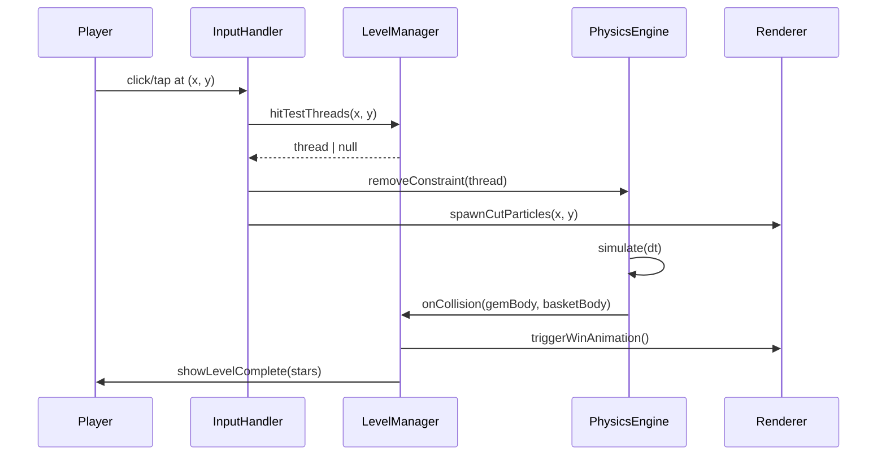

# Design Document: Weak Threads

## Overview

Weak Threads is a browser-based physics puzzle game inspired by Cut the Rope. The player cuts threads/ropes holding a gem to guide it into a target basket, using gravity and momentum. The game runs entirely in a single HTML file with no build step, using Matter.js for physics simulation and the Canvas 2D API for rendering.

The game features multiple handcrafted levels of increasing difficulty, smooth 60fps physics, particle effects on successful catches, and a clean visual style with a dark background and glowing neon-style elements.

The app is structured as a standalone `weak-threads/index.html` file, consistent with the existing `comic-reader` app in the workspace.

---

## Architecture



---

## Sequence Diagrams

### Level Load Flow



### Cut Thread Flow



---

## Components and Interfaces

### LevelManager

**Purpose**: Owns level definitions, loads/unloads levels, tracks win/loss state.

**Interface**:
```javascript
interface LevelManager {
  loadLevel(index: number): void
  getCurrentLevel(): LevelData
  onGemCaught(): void          // called by collision handler
  getThreadAt(x, y): Thread | null
  cutThread(thread: Thread): void
  reset(): void
}
```

**Responsibilities**:
- Holds the array of all `LevelData` definitions
- Builds Matter.js bodies and constraints from level data
- Detects win condition via collision events
- Tracks star rating (based on threads remaining when gem is caught)

---

### PhysicsEngine (wrapper around Matter.js)

**Purpose**: Thin wrapper that initialises Matter.js and exposes a clean API.

**Interface**:
```javascript
interface PhysicsEngine {
  init(canvas: HTMLCanvasElement): void
  addBody(body: Matter.Body): void
  removeBody(body: Matter.Body): void
  addConstraint(c: Matter.Constraint): void
  removeConstraint(c: Matter.Constraint): void
  onCollisionStart(handler: (pairs) => void): void
  step(dt: number): void
  clear(): void
}
```

**Responsibilities**:
- Creates `Matter.Engine`, `Matter.World`, `Matter.Runner`
- Exposes collision event subscription
- Provides `step()` for the game loop

---

### Renderer

**Purpose**: Draws the entire scene each frame onto a `<canvas>` element using Canvas 2D API.

**Interface**:
```javascript
interface Renderer {
  init(canvas: HTMLCanvasElement): void
  drawFrame(state: RenderState): void
  spawnParticles(x: number, y: number, type: 'cut' | 'win'): void
  drawUI(state: UIState): void
}
```

**Responsibilities**:
- Clears and redraws canvas every frame
- Draws anchors, threads (as bezier curves with glow), gem (circle with gradient), basket
- Manages particle system (array of short-lived particles)
- Draws HUD: level number, star indicators, restart button

---

### InputHandler

**Purpose**: Translates mouse/touch events into game actions.

**Interface**:
```javascript
interface InputHandler {
  attach(canvas: HTMLCanvasElement): void
  detach(): void
  onCut(handler: (x: number, y: number) => void): void
}
```

**Responsibilities**:
- Listens for `mousedown` and `touchstart`
- Converts event coordinates to canvas space (accounting for `devicePixelRatio` and canvas offset)
- Fires `onCut` callback with canvas-space coordinates

---

## Data Models

### LevelData

```javascript
/**
 * Complete description of a single puzzle level.
 */
const LevelData = {
  id: Number,           // 1-based level index
  name: String,         // display name, e.g. "First Cut"
  anchors: [AnchorDef], // fixed wall/ceiling attachment points
  threads: [ThreadDef], // rope segments connecting anchors to gem
  gem: GemDef,          // initial gem position (derived from thread endpoints)
  basket: BasketDef,    // target basket position and size
}
```

### AnchorDef

```javascript
const AnchorDef = {
  id: String,           // e.g. "a1"
  x: Number,            // canvas x (0–800)
  y: Number,            // canvas y (0–600)
}
```

### ThreadDef

```javascript
const ThreadDef = {
  id: String,           // e.g. "t1"
  from: String,         // anchor id OR "gem"
  to: String,           // anchor id OR "gem"
  length: Number,       // rest length in pixels
  stiffness: Number,    // 0.0–1.0 (Matter.js constraint stiffness)
}
```

### GemDef

```javascript
const GemDef = {
  x: Number,
  y: Number,
  radius: Number,       // default 18
  color: String,        // CSS color, e.g. "#a78bfa"
}
```

### BasketDef

```javascript
const BasketDef = {
  x: Number,
  y: Number,
  width: Number,
  height: Number,
}
```

### Particle

```javascript
const Particle = {
  x: Number,
  y: Number,
  vx: Number,
  vy: Number,
  life: Number,         // 0.0–1.0, decremented each frame
  color: String,
  radius: Number,
}
```

---

## Algorithmic Pseudocode

### Main Game Loop

```pascal
ALGORITHM gameLoop(timestamp)
INPUT: timestamp — DOMHighResTimeStamp from requestAnimationFrame
OUTPUT: side effects (physics step + canvas draw)

BEGIN
  dt ← clamp((timestamp - lastTimestamp) / 1000, 0, 0.05)
  lastTimestamp ← timestamp

  IF gameState = PLAYING THEN
    engine.step(dt)
    checkWinCondition()
  END IF

  renderer.drawFrame(buildRenderState())
  requestAnimationFrame(gameLoop)
END
```

**Preconditions:**
- `engine` and `renderer` are initialised
- `lastTimestamp` is set on first frame

**Postconditions:**
- Physics world advanced by `dt` seconds
- Canvas reflects current world state
- `requestAnimationFrame` scheduled for next frame

**Loop Invariants:**
- `dt` is always clamped to prevent spiral-of-death on tab focus restore
- `gameState` is one of `LOADING | PLAYING | WIN | LOSE`

---

### Hit-Test Thread

```pascal
ALGORITHM hitTestThread(x, y, threads)
INPUT: x, y — canvas coordinates of click/tap
       threads — array of active Thread objects
OUTPUT: closest Thread within threshold, or null

BEGIN
  CLOSEST ← null
  MIN_DIST ← HIT_THRESHOLD  // 12px

  FOR each thread IN threads DO
    // Sample N points along the constraint line
    FOR t ← 0 TO 1 STEP (1 / SAMPLE_COUNT) DO
      px ← lerp(thread.bodyA.position.x, thread.bodyB.position.x, t)
      py ← lerp(thread.bodyA.position.y, thread.bodyB.position.y, t)
      dist ← sqrt((px - x)^2 + (py - y)^2)

      IF dist < MIN_DIST THEN
        MIN_DIST ← dist
        CLOSEST ← thread
      END IF
    END FOR
  END FOR

  RETURN CLOSEST
END
```

**Preconditions:**
- `threads` contains only currently active (uncut) constraints
- `x`, `y` are in canvas coordinate space

**Postconditions:**
- Returns the thread whose midpoint is closest to the click, within 12px
- Returns `null` if no thread is within threshold

**Loop Invariants:**
- `MIN_DIST` is non-increasing across iterations
- `CLOSEST` always refers to the thread with the minimum distance seen so far

---

### Win Condition Check

```pascal
ALGORITHM checkWinCondition(gem, basket)
INPUT: gem — Matter.Body (circle)
       basket — BasketDef (AABB)
OUTPUT: boolean — true if gem centre is inside basket bounds

BEGIN
  gx ← gem.position.x
  gy ← gem.position.y

  inX ← gx >= basket.x AND gx <= basket.x + basket.width
  inY ← gy >= basket.y AND gy <= basket.y + basket.height

  RETURN inX AND inY
END
```

**Preconditions:**
- `gem.position` is updated by physics engine
- `basket` bounds are fixed for the level

**Postconditions:**
- Returns `true` if and only if gem centre is within basket AABB
- No side effects

---

### Star Rating

```pascal
ALGORITHM computeStars(totalThreads, threadsRemaining)
INPUT: totalThreads — number of threads in level
       threadsRemaining — number of uncut threads when gem caught
OUTPUT: stars — integer 1..3

BEGIN
  ratio ← threadsRemaining / totalThreads

  IF ratio >= 0.67 THEN
    RETURN 3
  ELSE IF ratio >= 0.34 THEN
    RETURN 2
  ELSE
    RETURN 1
  END IF
END
```

---

## Key Functions with Formal Specifications

### `loadLevel(index)`

```javascript
function loadLevel(index: number): void
```

**Preconditions:**
- `index` is a valid integer in range `[0, LEVELS.length)`
- Physics engine is initialised

**Postconditions:**
- Previous world bodies and constraints are cleared
- New bodies (anchors as static bodies, gem as dynamic circle, basket as sensor) added to world
- New constraints (threads) added to world
- `gameState` set to `PLAYING`
- `activeThreads` array populated

---

### `cutThread(thread)`

```javascript
function cutThread(thread: Matter.Constraint): void
```

**Preconditions:**
- `thread` is present in `activeThreads`
- `gameState === 'PLAYING'`

**Postconditions:**
- `thread` removed from `Matter.World`
- `thread` removed from `activeThreads`
- Cut particle effect spawned at thread midpoint
- `activeThreads.length` decremented by exactly 1

---

### `drawThread(ctx, constraint, alpha)`

```javascript
function drawThread(ctx: CanvasRenderingContext2D, constraint: Matter.Constraint, alpha: number): void
```

**Preconditions:**
- `ctx` is a valid 2D rendering context
- `constraint.bodyA` and `constraint.bodyB` have valid `position` vectors

**Postconditions:**
- A line (with glow shadow) is drawn from `bodyA.position` to `bodyB.position`
- Canvas state is restored (save/restore used)
- No mutations to constraint or body state

---

## Example Usage

```javascript
// Bootstrap the game
const canvas = document.getElementById('game-canvas')
const engine = new PhysicsEngine()
const renderer = new Renderer()
const input = new InputHandler()
const levelManager = new LevelManager(engine)

engine.init(canvas)
renderer.init(canvas)
input.attach(canvas)

// Wire up cut action
input.onCut((x, y) => {
  const thread = levelManager.getThreadAt(x, y)
  if (thread) {
    levelManager.cutThread(thread)
    renderer.spawnParticles(
      (thread.bodyA.position.x + thread.bodyB.position.x) / 2,
      (thread.bodyA.position.y + thread.bodyB.position.y) / 2,
      'cut'
    )
  }
})

// Wire up win detection
engine.onCollisionStart(pairs => {
  for (const { bodyA, bodyB } of pairs) {
    if (isGemBasketPair(bodyA, bodyB)) {
      levelManager.onGemCaught()
    }
  }
})

// Start
levelManager.loadLevel(0)
requestAnimationFrame(gameLoop)
```

---

## Correctness Properties

*A property is a characteristic or behavior that should hold true across all valid executions of a system — essentially, a formal statement about what the system should do. Properties serve as the bridge between human-readable specifications and machine-verifiable correctness guarantees.*

### Property 1: Level load populates ActiveThreads correctly

*For any* valid LevelData, after `loadLevel` is called with that level's index, `activeThreads.length` equals the number of ThreadDef entries in the LevelData.

**Validates: Requirements 1.3**

### Property 2: Cut operations maintain no-duplicate invariant

*For any* sequence of cut operations on a level, the ActiveThreads array shall never contain the same constraint object more than once.

**Validates: Requirements 2.3, 2.5**

### Property 3: dt is always clamped

*For any* frame timestamp, the value of `dt` passed to `engine.step()` is always in the range `(0, 0.05]`.

**Validates: Requirements 6.2, 6.3**

### Property 4: Win condition fires at most once per level

*For any* level, once GameState transitions to `WIN`, subsequent collision events between the Gem and Basket shall not invoke the win handler again.

**Validates: Requirements 4.3**

### Property 5: Particle life invariant

*For any* particle in the particle array, its `life` value is always in `[0, 1]`, and any particle whose `life` reaches `0` or below is removed from the array before the next draw call.

**Validates: Requirements 9.4, 9.5**

### Property 6: hitTestThread returns null for empty input

*For any* call to `hitTestThread(x, y, [])` with an empty threads array, the return value is `null`.

**Validates: Requirements 3.1**

### Property 7: hitTestThread returns null when no thread is within threshold

*For any* canvas coordinates `(x, y)` and any set of threads where all sampled points are more than 12px from `(x, y)`, `hitTestThread` returns `null`.

**Validates: Requirements 3.2**

### Property 8: Star rating is always in {1, 2, 3}

*For any* values of `totalThreads` and `threadsRemaining` where `0 <= threadsRemaining <= totalThreads` and `totalThreads > 0`, `computeStars` returns a value that is a member of `{1, 2, 3}`.

**Validates: Requirements 5.1, 5.2, 5.3, 5.4**

### Property 9: Particle array never exceeds cap

*For any* sequence of particle spawn events, the particle array length never exceeds 200 entries.

**Validates: Requirements 9.6**

### Property 10: drawThread does not mutate physics state

*For any* valid constraint and rendering context, calling `drawThread` shall not modify the position, velocity, or any other property of the constraint's bodies.

**Validates: Requirements 8.6**

---

## Error Handling

### Scenario 1: Matter.js fails to load (CDN down)

**Condition**: `window.Matter` is undefined after script load
**Response**: Show a friendly error overlay: "Could not load physics engine. Check your connection."
**Recovery**: Retry button reloads the page

### Scenario 2: Level index out of bounds

**Condition**: `loadLevel(index)` called with `index >= LEVELS.length`
**Response**: Clamp to last level; log warning to console
**Recovery**: Game continues on last level

### Scenario 3: Gem falls off screen

**Condition**: `gem.position.y > canvas.height + 100`
**Response**: Trigger lose state, show "Try Again" overlay
**Recovery**: Player clicks restart → `loadLevel(currentIndex)`

---

## Testing Strategy

### Unit Testing Approach

Key pure functions are testable in isolation:
- `hitTestThread(x, y, threads)` — mock thread bodies with known positions
- `checkWinCondition(gem, basket)` — pure AABB check, no physics needed
- `computeStars(total, remaining)` — pure integer function
- `buildRenderState()` — snapshot test against expected shape

### Property-Based Testing Approach

**Property Test Library**: fast-check

- For all `(x, y)` outside all thread segments by > 12px, `hitTestThread` returns `null`
- For all `(total, remaining)` where `remaining <= total`, `computeStars` returns a value in `{1, 2, 3}`
- For all valid `LevelData`, `loadLevel` produces `activeThreads.length === levelData.threads.length`

### Integration Testing Approach

- Load each level, simulate N physics steps, assert gem has not escaped world bounds
- Cut all threads on a level, assert gem falls off screen and lose state triggers

---

## Performance Considerations

- Canvas is sized to `devicePixelRatio` for crisp rendering on retina displays
- Particle array is capped at 200 entries; oldest particles evicted when cap is reached
- Matter.js `Runner` is not used — manual `requestAnimationFrame` loop gives full control over `dt` clamping
- Thread hit-testing samples 10 points per thread; with ≤8 threads per level this is negligible

---

## Security Considerations

- No user input is persisted or sent anywhere — fully offline, no XSS surface
- CDN scripts (Matter.js, Pixi if used) loaded with `integrity` attributes where available
- No `eval` or dynamic code execution

---

## Dependencies

| Library | Version | Purpose | CDN |
|---|---|---|---|
| Matter.js | 0.19.0 | 2D rigid body physics | `https://cdnjs.cloudflare.com/ajax/libs/matter-js/0.19.0/matter.min.js` |

No other runtime dependencies. Canvas 2D API is used directly for rendering to keep the bundle minimal and consistent with the comic-reader approach.
